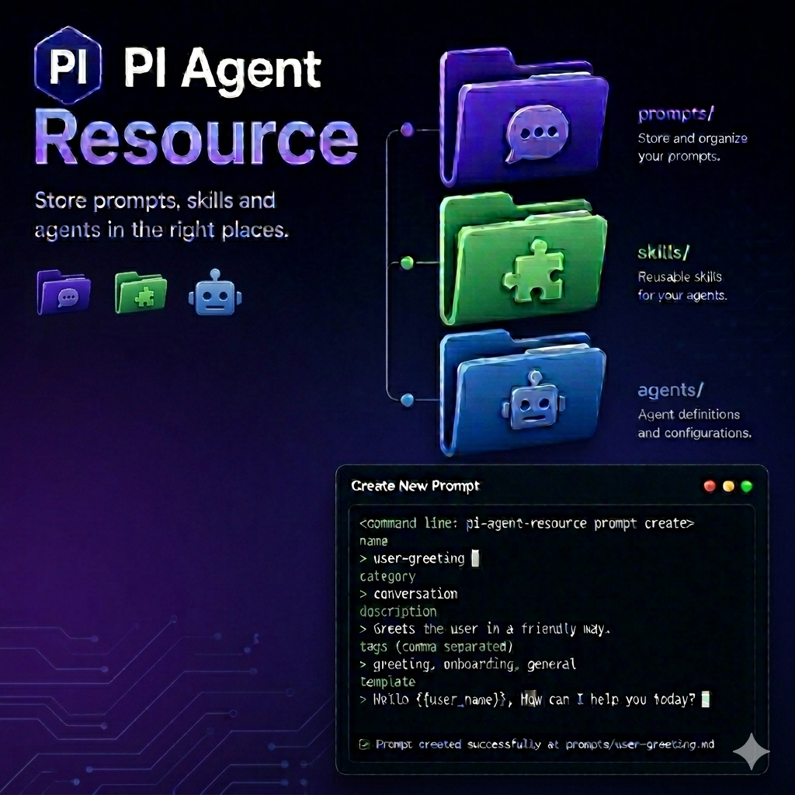

# @code-fixer-23/pi-agent-resource

`@code-fixer-23/pi-agent-resource` is a Pi extension package for creating, editing, and organizing Pi resources—agents, prompts, and skills—without leaving the Pi interface. It ships four extensions that cover the full lifecycle of each resource type: form-based creation with validated metadata, external editor integration for rich content, scoped placement in either your global Pi home or the current project directory, and pack management that bundles resources together and teaches Pi how to discover them during a session.

Every resource type in Pi follows strict layout conventions—correct frontmatter keys, `skills/<name>/SKILL.md` directory nesting, grouped prompt directories with `_index.md`, and so on. This package handles all of that so you can focus on writing the content itself. Each manager provides global and local variants of create, edit, and delete, with the same form and editor workflows in both scopes.

[](https://www.npmjs.com/package/@code-fixer-23/pi-agent-resource)
[](https://www.npmjs.com/package/@code-fixer-23/pi-agent-resource)
[](https://github.com/louiss0/pi-packages/blob/main/LICENSE)
[](https://github.com/louiss0/pi-packages/actions/workflows/ci.yml)



## Agent Manager

The agent manager creates and maintains agent definition files in either your global Pi home (`~/.pi/agent/agents`) or the current project's `.pi/agents` directory. All three subcommands work the same way regardless of scope; the only difference is where the resulting file is written.

### Commands

#### `resource:agent <create|edit|delete>`

Manages agents in `~/.pi/agent/agents`.

`create` opens a validated form collecting `name`, `description`, `tools` (comma-separated), and `model`. The name must be lowercase, the tools list is checked for valid formatting, and model values are constrained to a lowercase format before anything is written. Once the form passes, the extension writes a properly structured markdown file with the correct frontmatter.

`edit` presents a list of existing global agents. After you select one, the file opens in your external editor using `$VISUAL` or `$EDITOR` (checked in that order). The extension requires one of those variables to be set.

`delete` shows the same selection list and removes the chosen file.

#### `resource:local-agent <create|edit|delete>`

Runs the same create/edit/delete workflows against the current project's `.pi/agents` directory. Before making any change, the extension announces the resolved path so it is clear which workspace it is about to modify. This is useful when the agent should travel with a repository rather than live in your global Pi home.

---

## Prompt Manager

The prompt manager handles prompt files in `~/.pi/agent/prompts` or the project-local `.pi/prompts` directory. Prompt creation is a two-stage workflow because prompts have two distinct parts: structured frontmatter metadata and a freeform markdown template body.

### Commands

#### `resource:prompts <create|edit|delete>`

Manages prompts in `~/.pi/agent/prompts`.

`create` works in two stages. First, a form collects the required frontmatter fields: `name`, `description`, and the optional `argument-hint` field (validated for correct syntax). Once the metadata passes, the workflow continues into your external editor where you write the markdown template body. The prompt file is written only after both stages complete successfully.

`edit` opens an existing prompt in your external editor (`$VISUAL` or `$EDITOR`).

`delete` understands the difference between a plain prompt file and a grouped prompt (a directory containing `_index.md`). Selecting a grouped prompt removes the entire directory rather than just the index file, keeping the prompt layout clean.

#### `resource:local-prompt <create|edit|delete>`

Runs the same workflows against `.pi/prompts` in the current project. Local prompts are useful for repo-specific conventions or prompt packs that should travel with the repository.

---

## Skill Manager

The skill manager maintains the `skills/<name>/SKILL.md` layout that Pi requires. Skills live in `~/.pi/agent/skills` globally or in `.pi/skills` locally. Creation is staged so the common path stays short while still allowing richer metadata when needed. After any edit, Pi reloads automatically so the updated skill is immediately available.

### Commands

#### `resource:skill <create|edit|delete>`

Manages global skills in `~/.pi/agent/skills/<name>/SKILL.md`.

`create` runs in two stages. The first form collects the required `name` and `description` fields and ends with a confirmation checkbox: if you confirm, a second form appears to collect optional metadata (`license`, `compatibility`, `allowedTools`). Skipping the optional form still creates a valid skill; the confirmation just unlocks the extended fields for when you need them.

`edit` resolves the editing mode before opening anything. It first checks whether `--external-skill-editor` was passed, then reads the `[skill]` section of `.pi-resource.toml` if neither flag is set. After saving, Pi reloads so the skill is available in the current session without a manual restart.

`delete` removes the entire skill directory—not just the `SKILL.md` file—keeping the layout clean for when the skill is re-created later.

#### `resource:local-skill <create|edit|delete>`

Runs the same lifecycle against `.pi/skills/<name>/SKILL.md` in the current project. Useful for repository-scoped skills that ship with the codebase.

### Flags

#### `--external-skill-editor`

`--external-skill-editor` is a boolean flag that forces the `edit` subcommand to open the skill file in your external editor (`$VISUAL` or `$EDITOR`). It applies only to `edit`; passing it with `create` or `delete` produces an error.

### Features

**`.pi-resource.toml` editor configuration**

When `--external-skill-editor` is not set, the edit workflow consults a project-level `.pi-resource.toml` file. Setting `editor = "external"` under `[skill]` makes every skill edit in that project open in the external editor without requiring anyone to pass the flag manually:

```toml
[skill]
editor = "external"
```

The flag takes precedence over the file. If neither is set, the extension opens the skill through the external editor by default.

---

## Pack

The pack extension groups skills and prompts into named bundles under `.pi/packs` and registers those bundles with Pi's resource discovery system. Once a pack is loaded, its contents are available alongside your global and local resources for the duration of the session. Packs can be created with content upfront, populated incrementally, or reorganized by moving individual resources between pack, local, and global scopes.

### Commands

#### `resource:pack <create|delete>`

Manages pack containers.

`create` collects a pack name, asks which resource types the pack should contain (skills, prompts, or both), and then asks whether to prefill resources now or generate starter example files. Choosing to prefill runs the same validated form and editor workflows used by the skill and prompt managers. Skipping prefill writes a minimal `example.md` or `example/SKILL.md` so the pack structure is ready to populate later.

`delete` opens a multi-select list of existing packs and removes all selected pack directories in one run.

#### `resource:pack:skill <create|edit|delete|move-local|move-local-to-pack|move-global|move-global-to-pack>`

Manages skills inside packs and moves them between locations.

- `create` adds a new skill to a chosen pack using the same staged required-then-optional metadata flow as the skill manager.
- `edit` opens the packed skill in the external editor.
- `delete` removes the skill from the selected pack.
- `move-local` extracts the skill from a pack and places it in the project's local skill directory, removing it from the pack.
- `move-local-to-pack` imports a local skill into a chosen pack, removing it from the local directory.
- `move-global` extracts the skill from a pack and promotes it to the global skill store.
- `move-global-to-pack` imports a global skill into a chosen pack, removing it from the global store.

#### `resource:pack:prompt <create|edit|delete|move-local|move-local-to-pack|move-global|move-global-to-pack>`

Runs the same management for prompts inside packs. `create` uses the two-stage frontmatter form and editor workflow. Move commands mirror the skill variants, targeting the global and local prompt directories instead.

#### `resource:pack:session:new [packs]`

Starts a new Pi session with the specified packs loaded. Pass pack names separated by spaces or commas to start immediately. When no argument is provided, a multi-select picker appears so you can choose packs interactively. The new session file links back to the parent session.

#### `resource:pack:session:reload [packs]`

Reloads the current Pi session with a new pack selection. Passing names switches the active packs immediately. Omitting the argument opens the same interactive picker as `session:new`.

### Flags

#### `--resource:load-pack <string>`

`--resource:load-pack` preloads one or more packs when Pi starts. The value accepts pack names separated by spaces or commas. This is the recommended approach for bootstrapping a consistent session profile from a shell alias or a project launch configuration.

### Features

`pi-agent-resource` provides pack creation, pack editing, and pack session loading for Pi resources. It also keeps the active pack list in the OS temp directory so the same selection can be reused during the current run.

> [!WARNING] Pack selection only lasts for the current Pi run

> `pi-agent-resource` stores the active pack list in a JSON file inside the OS temp directory so pack loading, new sessions, and reloads can reuse the same selection while Pi is open.

> `resource:pack:session:new`, `resource:pack:session:reload`, and `resources_discover` all work from that temp file, and Pi deletes it on quit.

> This feature is session-scoped only; it is not meant to survive a shutdown or restart.

---

## Development

Run tasks through Nx from the workspace root:

```sh
pnpm nx run pi-agent-resource:lint
pnpm nx run pi-agent-resource:typecheck
pnpm nx run pi-agent-resource:test
pnpm nx run pi-agent-resource:metadata
```
